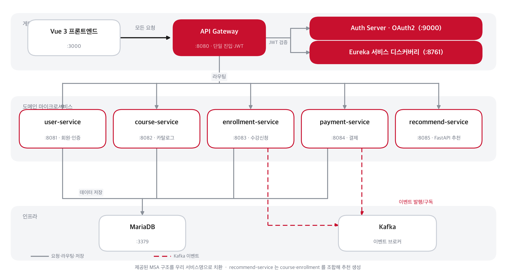
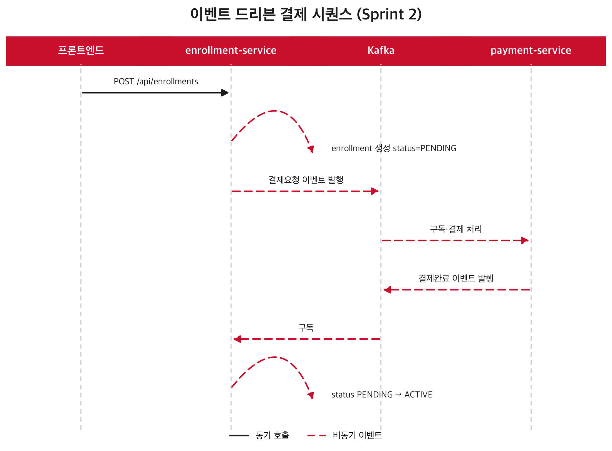

# LearnNexus HRD

> 기업 교육 기획·매칭 통합 플랫폼 — 사업계획에서 교육 니즈로, AI 추천에서 계약·결제·만족도까지 하나의 흐름으로.
> **SKALA MSA Capstone** · Agile 방법론 및 MSA 개발

HRD 담당자는 흩어진 공급자·과정 정보 속에서 교육을 찾고, 일정·방식·지역·교육비를 일일이 비교하고, 신청·결제·확정·만족도를 엑셀과 메일로 관리한다. LearnNexus HRD는 이 파편화된 과정을 **하나의 워크스페이스**로 묶는다. 사업계획을 입력하면 교육 니즈를 뽑고, 수강 이력을 근거로 과정을 추천하고, 계약과 결제, 만족도까지 한 화면에서 이어진다.

---

## 팀 구성

| 역할 | 담당 |
| --- | --- |
| 프론트엔드 | 신주용, 정다운 |
| 백엔드 | 최도한, 손서현 |
| 발표자료(PPT) | 유덕현 |
| 발표 | 김지원 |

---

## 아키텍처



Spring Cloud 기반 MSA. 모든 요청은 **API Gateway(:8080)** 단일 진입점을 지나 JWT 검증 후 각 서비스로 라우팅된다. 서비스는 **Eureka**에 등록되어 이름으로 서로를 호출하고, 수강신청과 결제는 **Kafka 이벤트**로 느슨하게 결합된다.

| 서비스 | 포트 | 스택 | 담당 |
| --- | --- | --- | --- |
| api-gateway | 8080 | Spring Cloud Gateway | 단일 진입점·라우팅·JWT 검증 |
| auth-server | 9000 | Spring Authorization Server | OAuth2 발급·검증 |
| eureka-server | 8761 | Spring Cloud Netflix | 서비스 디스커버리 |
| user-service | 8081 | Spring Boot | 회원·인증·프로필·비밀번호 재설정 |
| course-service | 8082 | Spring Boot | 교육 카탈로그 |
| enrollment-service | 8083 | Spring Boot | 수강신청·계약·만족도 |
| payment-service | 8084 | Spring Boot | 결제 |
| recommend-service | 8085 | **FastAPI** | 규칙 기반 추천 |
| kafka / mariadb | — | Confluent / MariaDB | 이벤트 브로커 / 저장소 |

### 이벤트 드리븐 결제 (Sprint 2)



수강신청은 동기 호출이 아니라 이벤트로 결제와 분리된다. 결제 서비스 장애가 신청 자체를 막지 않는다. 신청 직후 `PENDING`, Kafka 결제 완료 이벤트를 받으면 약 3~4초 뒤 `ACTIVE`로 자동 전환된다.

---

## 핵심 기능

- **OAuth2 인증** — 인증 서버 경유 로그인, 회원가입, **비밀번호 재설정**(이메일+이름 확인 → 재설정 링크)
- **교육 니즈 입력 → AI 추천** — 수강 이력의 최빈 분야를 분석해 미수강 과정을 인기순으로 추천(recommend-service, 규칙 기반)
- **교육 카탈로그** — 분야·방식·지역 필터, 검색, 정렬, 페이지네이션. 일정·기간·난이도까지 비교
- **수강신청 → 결제 → 확정** — Kafka 이벤트로 상태가 `PENDING → ACTIVE` 자동 전환
- **만족도 조사** — 교육·강사·업무 활용도·난이도 4개 지표 + 의견, 응답률·평균·후속 조치 집계
- **교육 공급자** — 공급자 대시보드(본인 프로그램만 집계), 프로그램 등록(일정 필드 포함), 프로필 수정

---

## 실행

전제 : Docker Desktop · JDK 21 · Node 18+. 강의 배포 이미지(`msa-lecture/auth-server:1.0`, `msa-lecture/api-gateway:1.0`, `msa-lecture-*:latest`)가 로컬 Docker 에 로드돼 있어야 한다(auth-server·api-gateway 는 소스가 아니라 이미지로만 제공됨).

```bash
# 1) 전체 스택 기동
docker compose up -d

# 2) 도메인 서비스는 소스에서 재빌드해 반영 (course/user/enrollment)
docker build -t msa-lecture-course-service:latest ./course-service
docker build -t msa-lecture-user-service:latest ./user-service
docker build -t msa-lecture-enrollment-service:latest ./enrollment-service
docker compose up -d --no-build --pull never course-service user-service enrollment-service

# 3) 프론트엔드
cd vue-frontend
cp .env.example .env          # 게이트웨이·OAuth 설정 (필수)
npm install
npm run dev                   # http://localhost:3000
```

> `.env` 가 없으면 OAuth 시크릿이 없어 로그인이 안 된다(시크릿을 번들에 하드코딩하지 않기 위한 의도).

### 데모 계정 (바로 로그인 가능)

| 역할 | 이메일 | 비밀번호 |
| --- | --- | --- |
| HRD 담당자 | `hrd@skala.com` | `Skala1234!` |
| 교육 공급자 | `prov1@skala.com` | `Skala1234!` |

> 시드 데모 데이터의 대표 계정. 회원가입으로 새 계정을 만들어도 된다.

---

## 주요 API

| Method | URL | 서비스 | 설명 |
| --- | --- | --- | --- |
| POST | `/api/users/register` | user | 회원가입 |
| GET | `/api/users/me` | user | 내 정보 |
| PUT | `/api/users/{id}` | user | 프로필 수정 (본인만) |
| POST | `/api/users/password/reset-request` | user | 비밀번호 재설정 요청 |
| POST | `/api/users/password/reset-confirm` | user | 비밀번호 재설정 확정 |
| GET | `/api/courses` | course | 교육 목록 |
| GET | `/api/courses/{id}` | course | 교육 상세 |
| POST | `/api/courses` | course | 교육 등록(공급자) |
| GET | `/api/recommend/{userId}` | recommend | AI 추천 |
| POST | `/api/enrollments` | enrollment | 수강신청 |
| GET | `/api/enrollments/my` | enrollment | 내 수강/계약 |
| POST | `/api/enrollments/{id}/survey` | enrollment | 만족도 제출 |
| GET | `/api/enrollments/courses/{id}/surveys/summary` | enrollment | 만족도 집계 |

보호 API는 모두 `Authorization: Bearer <JWT>`. 게이트웨이가 검증한다.
Swagger UI : 각 서비스 `/swagger-ui/index.html`.

---

## 기술 스택

**프론트** Vue 3 (Composition API) · Pinia · Vue Router · Vite · Axios
**백엔드** Spring Boot · Spring Cloud (Gateway·Eureka) · Spring Authorization Server · FastAPI
**인프라** OAuth2 · Kafka · MariaDB · Docker Compose

---

## 화면

### 인증 · 대시보드
| 로그인 | HRD 대시보드 |
| --- | --- |
|  |  |

### 교육 기획 · 추천
| 교육 니즈 입력 | AI 추천 |
| --- | --- |
|  |  |

### 카탈로그 · 상세
| 교육 카탈로그 | 교육 상세 |
| --- | --- |
|  |  |

### 계약 · 만족도
| 계약/신청 | 만족도 조사 |
| --- | --- |
|  |  |

### 교육 공급자
| 공급자 대시보드 | 공급자 프로필 |
| --- | --- |
|  |  |
