# LearnNexus HRD

> **기업 교육 기획·매칭 통합 플랫폼**
> 사업계획에서 교육 니즈로, 과정 추천에서 계약·결제·만족도까지 — 하나의 흐름으로.
>
> SKALA MSA Capstone · Agile 방법론 및 마이크로서비스 아키텍처

<br/>

[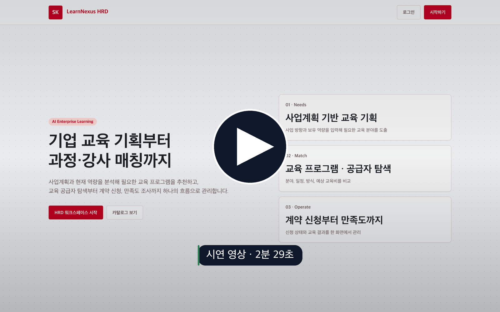](https://youtu.be/Uq5uXnrd7jU)

<sub>위 이미지를 클릭하면 전체 시연 영상(2분 29초)이 재생됩니다 · <a href="https://youtu.be/Uq5uXnrd7jU">YouTube에서 보기</a></sub>

<br/>

## 프로젝트 개요

HRD 담당자는 교육 하나를 도입하기까지 여러 번 맥락을 갈아탄다.

- 흩어진 공급자·과정 정보 속에서 **교육을 검색**하고,
- 일정·방식·지역·교육비를 **일일이 비교**하고,
- 신청·결제·확정·만족도를 **엑셀과 메일로 관리**한다.

**LearnNexus HRD** 는 이 파편화된 과정을 하나의 워크스페이스로 묶는다.

사업계획을 입력하면 **교육 니즈**를 도출하고, 수강 이력을 근거로 **과정을 추천**하고,
**계약·결제·만족도**까지 한 화면에서 자연스럽게 이어진다. 추천은 수강 이력의 최빈 분야를 분석해
미수강 과정을 제안하는 방식으로, 이 추천이 교육 기획의 출발점을 잡아 준다.

**이해관계자**

| 이해관계자 | Pain Point | 제공 가치 |
| :--- | :--- | :--- |
| HRD 담당자 | 흩어진 과정·공급자 정보, 수작업 비교·관리 | 통합 검색·비교, 과정 추천, 계약·만족도 한 화면 관리 |
| 교육 공급자 | 프로그램 노출·신청 현황 파악 어려움 | 프로그램 등록, 본인 과정만 모은 대시보드 |
| 임직원 | 어떤 교육이 내게 맞는지 불투명 | 추천 기반 수강, 만족도 피드백 |

<br/>

## 유사 서비스 비교

국내 대표 기업교육 플랫폼은 대부분 **자체 콘텐츠를 제공하는 학습 플랫폼**이다.
LearnNexus HRD 는 콘텐츠를 직접 만들지 않고 **외부 공급자를 매칭**하며, 기획 → 계약 → 결제 → 만족도를 한 흐름으로 묶는 **HRD 소싱·운영** 모델이라는 점이 다르다.

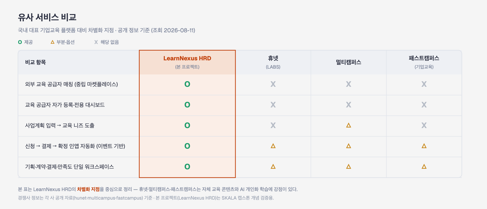

<br/>

## 핵심 기능

- **OAuth2 인증** — 인증 서버 경유 로그인, 회원가입, 비밀번호 재설정(이메일+이름 확인 → 재설정 링크)
- **교육 니즈 입력 → 과정 추천** — 수강 이력의 최빈 분야를 분석해 미수강 과정을 인기순으로 추천 (규칙 기반, 콜드스타트 폴백)
- **교육 카탈로그** — 분야·방식·지역 필터, 검색, 정렬, 페이지네이션. 일정·기간·난이도까지 비교
- **수강신청 → 결제 → 확정** — Kafka 이벤트로 상태가 `PENDING → ACTIVE` 자동 전환
- **만족도 조사** — 교육·강사·업무 활용도·난이도 4개 지표 + 의견, 응답률·평균 집계
- **교육 공급자** — 본인 프로그램만 집계하는 대시보드, 프로그램 등록(일정 필드 포함), 프로필 수정

<br/>

## 추천 로직

`recommend-service`(FastAPI)는 학습된 모델 없이 **규칙 기반(rule-based)** 으로 동작한다. 별도 AI 모델은 쓰지 않는다.
데이터가 없는 신규 사용자에게도 결과를 낼 수 있고(콜드스타트에 강함), "왜 이 과정을 추천했는가"를 설명할 수 있는 것이 장점이다.
추천에 필요한 데이터는 자체 DB가 아니라 **다른 서비스를 호출해** 모으므로, 추천 로직만 독립적으로 배포·교체할 수 있다.

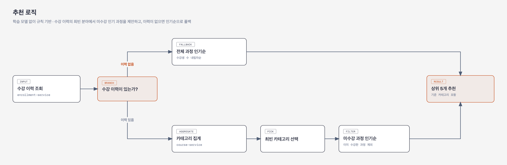

동작을 순서대로 풀면:

1. **수강 이력 조회** — `enrollment-service`에서 사용자의 `ACTIVE` 수강 과정 ID 목록을 가져온다.
2. **콜드스타트 폴백** — 이력이 없으면, 전체 과정을 수강생 수(`enrollment_count`) 기준 내림차순으로 정렬해 **인기 과정**을 추천한다.
3. **관심 분야 추정** — 이력이 있으면, `course-service`에서 수강한 과정들의 카테고리를 집계해 **가장 많이 들은 분야(최빈 카테고리)** 를 고른다.
4. **미수강 과정 선별** — 그 카테고리에서 **아직 듣지 않은** 과정만 골라 인기순으로 정렬한다(이미 수강한 과정은 제외).
5. **상위 N개 반환** — 최대 5개를 추천 사유(기준 카테고리)와 함께 응답한다.

> 한 줄 요약 — "가장 많이 들은 분야에서, 아직 안 들은 인기 과정"을 제안한다.
> 규칙이 단순해 결과가 예측 가능하며, 이후 협업 필터링·임베딩 기반 추천으로 이 서비스만 교체해 고도화할 수 있다.

<br/>

## 스프린트 구성 (Agile)

핵심 가치가 끝까지 동작하는 최소 버전(MVP)을 **Sprint 1** 에서 완성하고,
결제·이벤트 같은 확장 기능을 **Sprint 2** 에서 점진적으로 덧붙였다.

| 스프린트 | 목표 | 범위 |
| :--- | :--- | :--- |
| **Sprint 1 · MVP** | 핵심 가치가 처음부터 끝까지 흐르는 최소 버전 | 회원(user) · 교육 카탈로그(course) · 수강신청(enrollment) |
| **Sprint 2 · 확장** | 결제·이벤트로 신청 흐름을 자동화하고 부가 가치를 더함 | 결제(payment) · Kafka 이벤트 연동(`PENDING → ACTIVE`) · 과정 추천 · 만족도 조사 · 비밀번호 재설정 |

Sprint 2 에서 결제·이벤트를 새로 추가할 때 Sprint 1 의 회원·과목·수강신청 서비스는 **손대지 않았다.**
기능이 독립된 서비스(MSA)로 분리돼 있어, Agile 의 "점진적 확장"과 MSA 의 "독립 배포"가 맞물리는 지점이다.

<br/>

## 개발 타임라인

기획 → 업무 분배 → API 명세 → 개발을 끊김 없이 이어, **2026-08-10(월) 14:00 부터 08-11(화) 15:30 까지** 진행했다.
개발은 프론트엔드·백엔드가 병렬로 진행했고, `feature/frontend-hrd-ui` 브랜치에서 작업해 PR(#1·#3)로 `main` 에 통합했다.

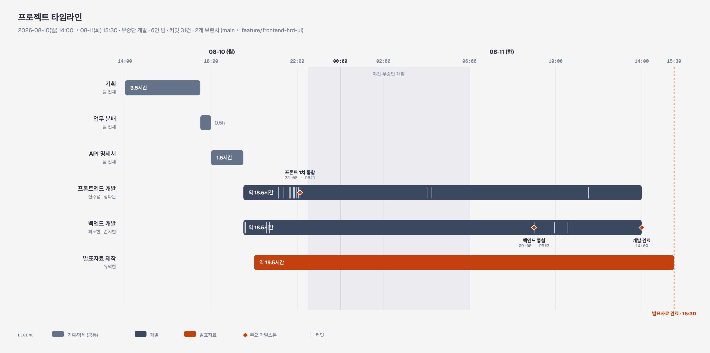

<br/>

## 아키텍처

Spring Cloud 기반 마이크로서비스 아키텍처.
모든 요청은 **API Gateway(:8080)** 단일 진입점을 지나 JWT 검증을 거친 뒤 각 서비스로 라우팅된다.
서비스는 **Eureka** 에 등록되어 이름으로 서로를 호출하고, **수강신청과 결제는 Kafka 이벤트로 느슨하게 결합**된다.

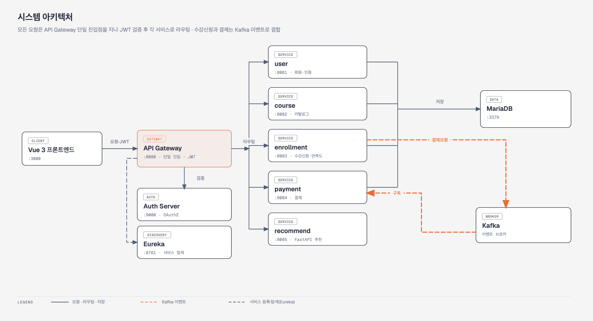

| 서비스 | 포트 | 스택 | 책임 |
| :--- | :--- | :--- | :--- |
| api-gateway | 8080 | Spring Cloud Gateway | 단일 진입점 · 라우팅 · JWT 검증 |
| auth-server | 9000 | Spring Authorization Server | OAuth2 발급·검증 |
| eureka-server | 8761 | Spring Cloud Netflix | 서비스 디스커버리 |
| user-service | 8081 | Spring Boot | 회원 · 인증 · 프로필 · 비밀번호 재설정 |
| course-service | 8082 | Spring Boot | 교육 카탈로그 |
| enrollment-service | 8083 | Spring Boot | 수강신청 · 계약 · 만족도 |
| payment-service | 8084 | Spring Boot | 결제 |
| recommend-service | 8085 | **FastAPI** | 규칙 기반 추천 |

> `api-gateway` 와 `auth-server` 는 강의에서 컨테이너 이미지로만 배포되어 소스가 저장소에 포함되지 않는다.

<br/>

## 이벤트 드리븐 결제 (Sprint 2)

수강신청은 결제를 **동기 호출로 기다리지 않는다.**
신청 즉시 `PENDING` 으로 응답하고, Kafka 결제 완료 이벤트를 받으면 약 3~4초 뒤 `ACTIVE` 로 자동 전환된다.
덕분에 결제 서비스에 장애가 나도 신청 자체는 막히지 않는다.

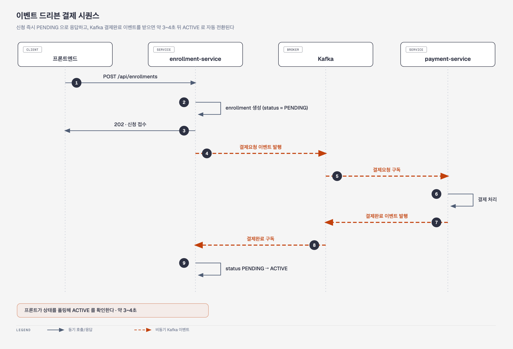

<br/>

## 데이터 모델 (ERD)

6개 테이블. `users` 를 중심으로 교육 과정·수강신청·결제가 외래키로 연결되고, 만족도(surveys)와 비밀번호 재설정 토큰은 서비스 간 논리 참조로 이어진다.

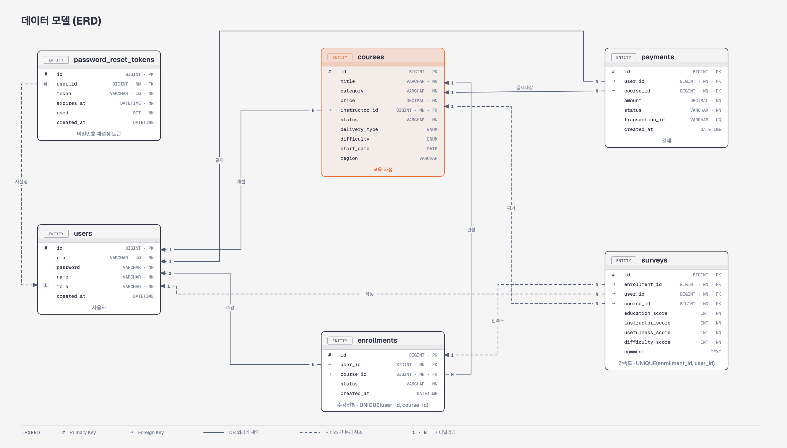

<br/>

## 저장소 구조

```
SKALA-MSA-CAPSTONE/
├── eureka-server/          # 서비스 디스커버리 (Spring Cloud Netflix)
├── user-service/           # 회원·인증·프로필·비밀번호 재설정
├── course-service/         # 교육 카탈로그
├── enrollment-service/     # 수강신청·계약·만족도
├── payment-service/        # 결제 (Kafka 이벤트 소비)
├── recommend-service/      # 규칙 기반 추천 (FastAPI)
├── vue-frontend/           # Vue 3 SPA
│   └── src/
│       ├── api/            # Axios API 클라이언트
│       ├── components/     # 공통 UI 컴포넌트
│       ├── composables/    # 재사용 로직 (공급자명 해석 등)
│       ├── router/         # 라우트 정의·인증 가드
│       ├── store/          # Pinia 상태 (인증)
│       ├── utils/          # 도메인 헬퍼
│       └── views/          # 페이지 단위 화면
├── init-db/                # DB 초기화 스크립트
├── docs/                   # 다이어그램·스크린샷 등 문서 자산
├── docker-compose.yml      # 전체 스택 오케스트레이션
└── README.md
```

각 Spring Boot 서비스는 동일한 레이어드 구조를 따른다 —
`controller`(API) · `service`(도메인 로직) · `repository`(영속성) · `entity`(도메인 모델) · `dto`(전송 객체) · `config`(설정).

> `api-gateway`, `auth-server` 는 이미지로만 제공되어 소스 디렉터리가 없다.

<br/>

## 실행

**사전 요구사항** · Docker Desktop · JDK 21 · Node 18+
강의 배포 이미지(`msa-lecture/auth-server:1.0`, `msa-lecture/api-gateway:1.0`, `msa-lecture-*:latest`)가 로컬 Docker 에 로드돼 있어야 한다.

```bash
# 1) 전체 스택 기동
docker compose up -d

# 2) 도메인 서비스는 소스에서 재빌드해 반영 (course / user / enrollment)
docker build -t msa-lecture-course-service:latest ./course-service
docker build -t msa-lecture-user-service:latest ./user-service
docker build -t msa-lecture-enrollment-service:latest ./enrollment-service
docker compose up -d --no-build --pull never course-service user-service enrollment-service

# 3) 프론트엔드
cd vue-frontend
cp .env.example .env      # 게이트웨이·OAuth 설정 (필수)
npm install
npm run dev               # http://localhost:3000
```

> `.env` 는 게이트웨이 주소 · OAuth `client-id` · `redirect-uri` 를 담는다.
> `client_secret` 은 프론트에 두지 않는다 — user-service(BFF)가 서버에서 보관하며, 로그인 시 `POST /api/users/token` 으로 인가 코드를 토큰으로 교환한다.

### 데모 계정

| 역할 | 이메일 | 비밀번호 |
| :--- | :--- | :--- |
| HRD 담당자 | `hrd@skala.com` | `Skala1234!` |
| 교육 공급자 | `prov1@skala.com` | `Skala1234!` |

> 시드 데이터의 대표 계정. 회원가입으로 새 계정을 만들어도 된다.

<br/>

## 주요 API

| Method | URL | 서비스 | 설명 |
| :--- | :--- | :--- | :--- |
| `POST` | `/api/users/register` | user | 회원가입 |
| `POST` | `/api/users/token` | user | 로그인 코드→토큰 교환 (BFF, 시크릿 서버 보관) |
| `GET` | `/api/users/me` | user | 내 정보 |
| `GET` | `/api/users` | user | 사용자·공급자 목록 (`?ids=`·`?role=`) |
| `PUT` | `/api/users/{id}` | user | 프로필 수정 (본인만) |
| `POST` | `/api/users/password/reset-request` | user | 비밀번호 재설정 요청 |
| `POST` | `/api/users/password/reset-confirm` | user | 비밀번호 재설정 확정 |
| `GET` | `/api/courses` | course | 교육 목록 (페이징·필터·정렬) |
| `GET` | `/api/courses/{id}` | course | 교육 상세 |
| `POST` | `/api/courses` | course | 교육 등록 (공급자) |
| `GET` | `/api/recommend/{userId}` | recommend | 과정 추천 |
| `POST` | `/api/enrollments` | enrollment | 수강신청 |
| `GET` | `/api/enrollments/my` | enrollment | 내 수강/계약 (페이징·만족도 제출 여부 포함) |
| `POST` | `/api/enrollments/{id}/survey` | enrollment | 만족도 제출 |
| `GET` | `/api/enrollments/courses/{id}/surveys/summary` | enrollment | 만족도 집계 |

> 보호 API 는 모두 `Authorization: Bearer <JWT>` 를 요구하며 게이트웨이가 검증한다.
> Swagger UI · 각 서비스 `/swagger-ui/index.html`

<br/>

## 기술 스택

| 영역 | 기술 |
| :--- | :--- |
| **프론트엔드** | Vue 3 (Composition API) · Pinia · Vue Router · Vite · Axios |
| **백엔드** | Spring Boot 3 · Spring Cloud Gateway · Spring Cloud Netflix Eureka · Spring Authorization Server |
| **추천 서비스** | FastAPI (Python) |
| **데이터 · 메시징** | MariaDB · Apache Kafka |
| **인증** | OAuth2 · JWT |
| **인프라** | Docker · Docker Compose |
| **빌드** | Gradle (백엔드) · Vite / npm (프론트엔드) |

<br/>

## 화면

### 1. 로그인
OAuth2 인증 서버를 경유하는 로그인 화면. 회원가입·비밀번호 재설정 진입점을 함께 제공한다.

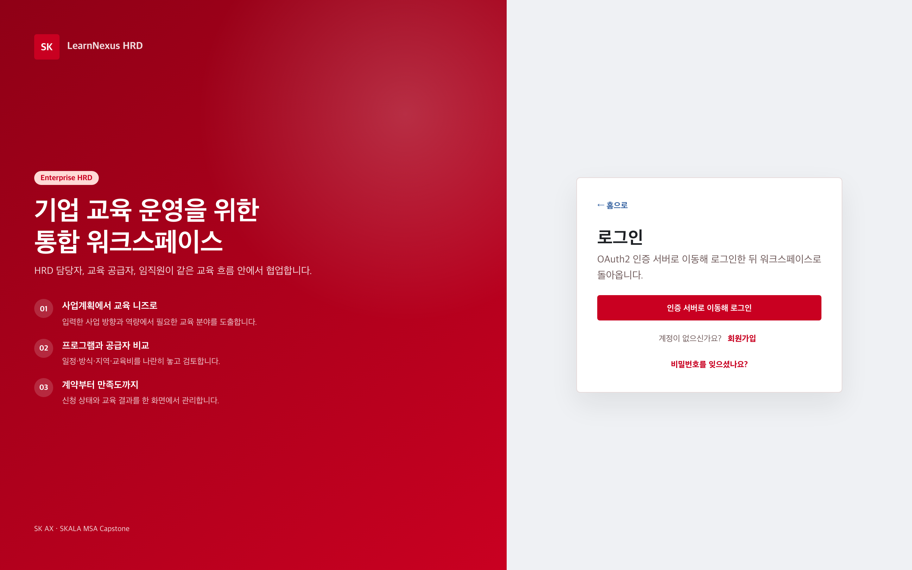

### 2. HRD 대시보드
담당자의 교육 현황을 한눈에 — 진행 중인 계약, 수강 인원, 만족도 요약.

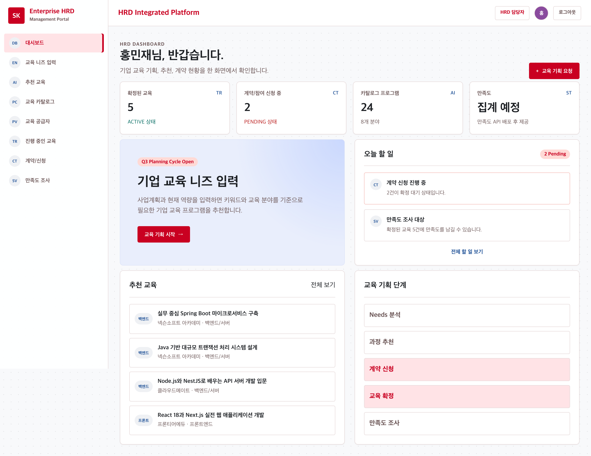

### 3. 교육 니즈 입력
사업계획·직무를 입력해 필요한 교육 분야를 도출하는 화면.

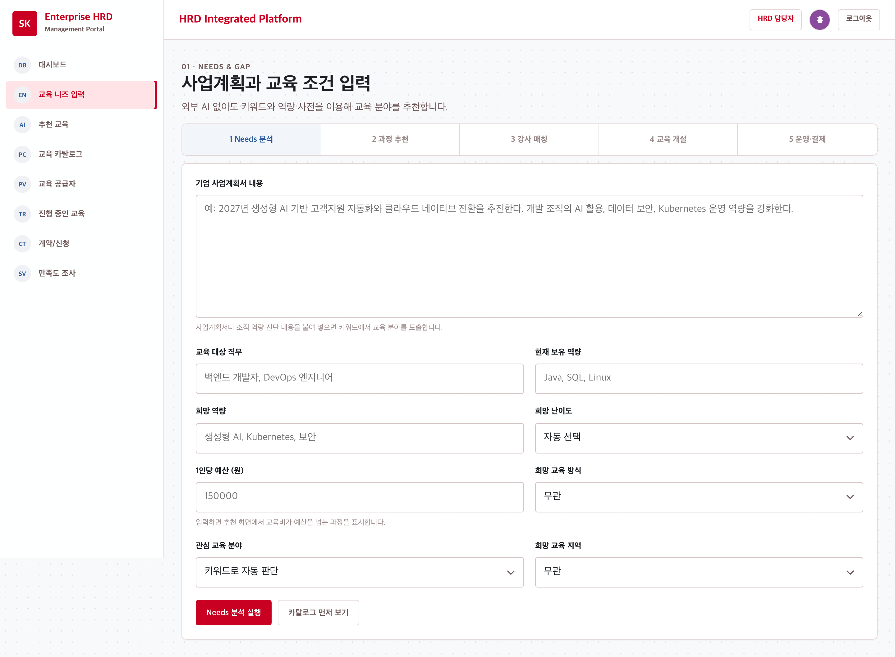

### 4. 추천 교육
수강 이력의 최빈 분야를 근거로 미수강 과정을 인기순으로 추천한다.

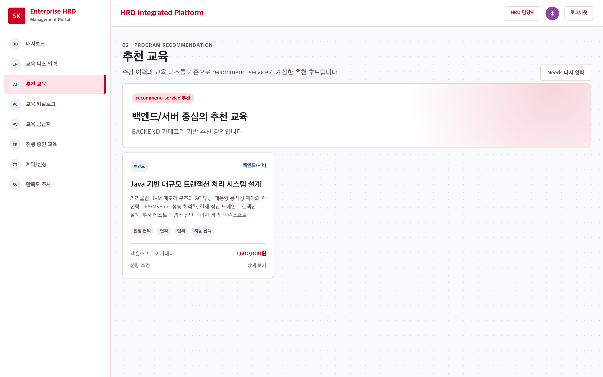

### 5. 교육 카탈로그
분야·방식·지역 필터와 검색·정렬·페이지네이션을 갖춘 과정 목록.

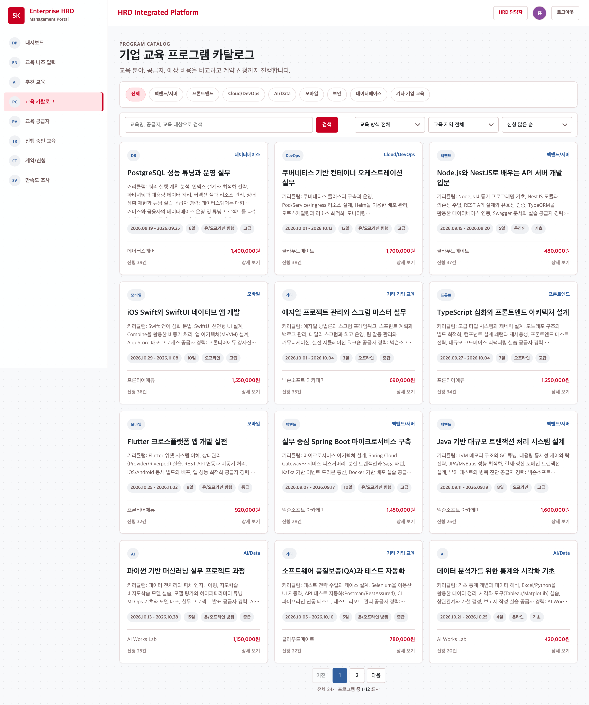

### 6. 교육 상세
일정·기간·방식·지역·난이도·교육비 등 운영 정보를 비교하고 신청한다.

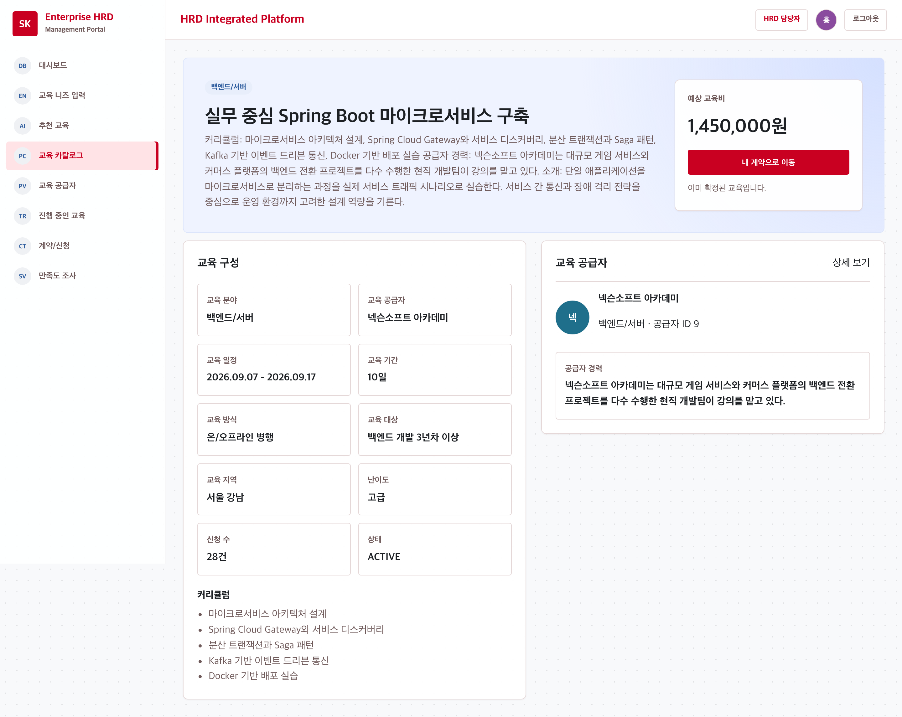

### 7. 계약 · 수강신청
신청 → 결제 → 확정으로 이어지는 계약 목록. 상태가 `PENDING → ACTIVE` 로 전환된다.

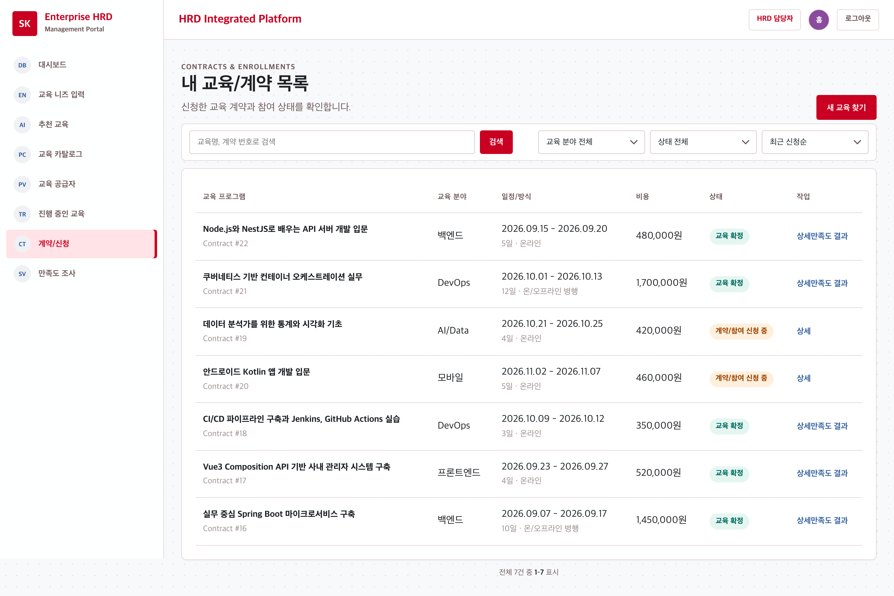

### 8. 만족도 조사
교육·강사·업무 활용도·난이도를 5점 척도로 평가하고 의견을 남긴다.

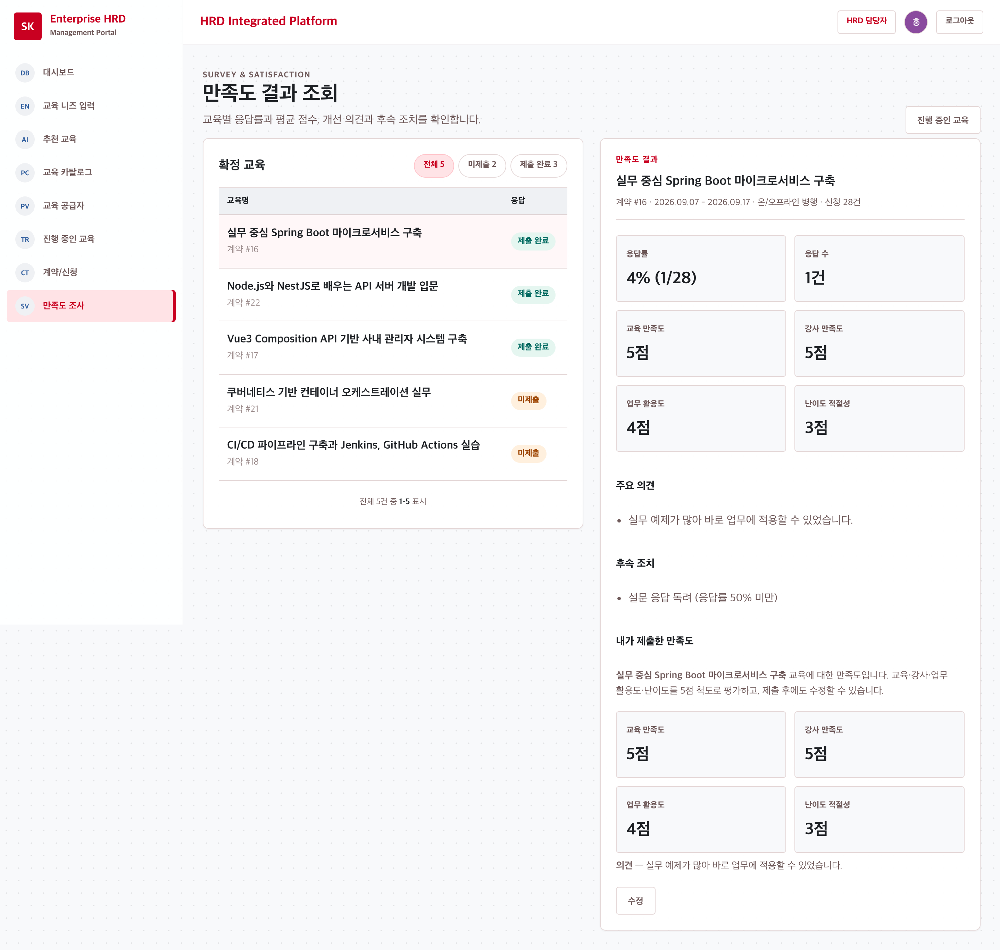

### 9. 공급자 대시보드
교육 공급자가 본인 프로그램의 신청·수강 현황만 모아 보는 화면.

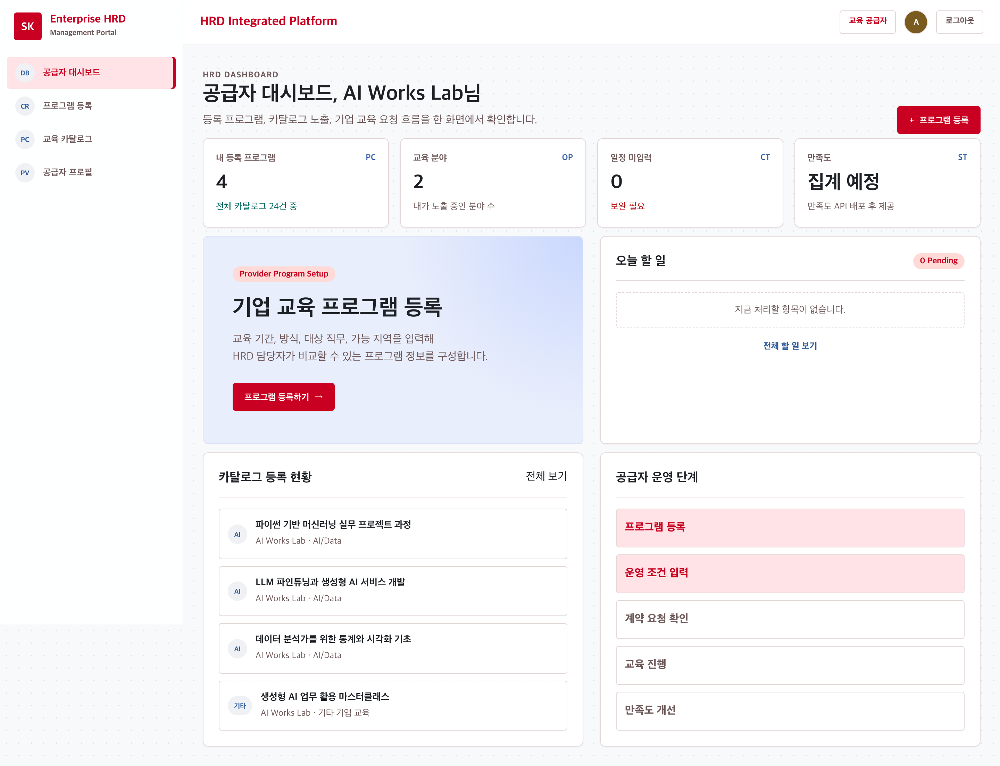

### 10. 공급자 프로필
공급자 소개·연락처를 관리하는 프로필 수정 화면.

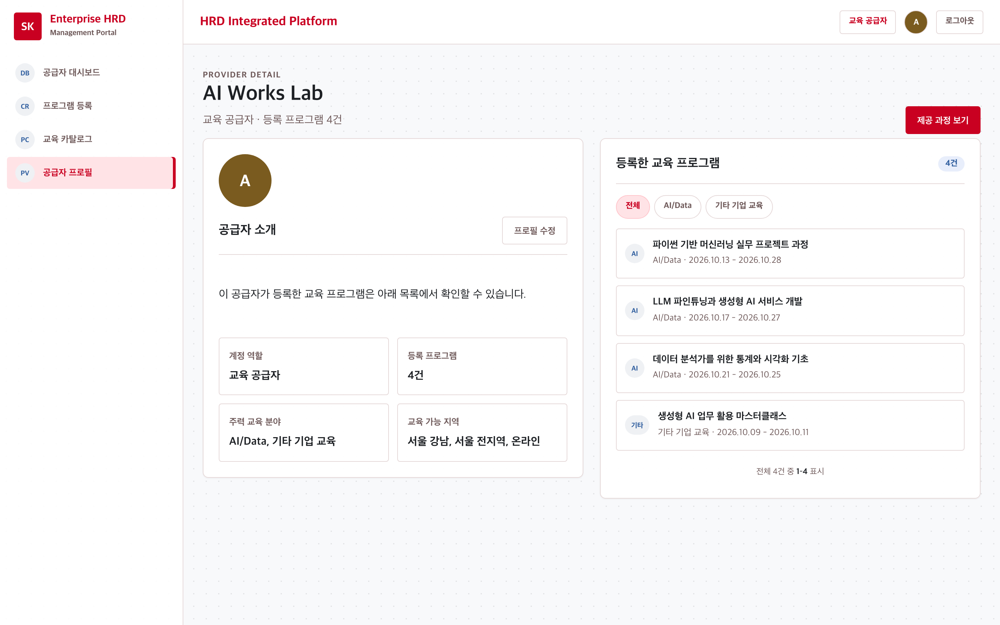

<br/>

## 팀 구성

| 역할 | 담당 |
| :--- | :--- |
| 프론트엔드 | 신주용, 정다운 |
| 백엔드 | 최도한, 손서현 |
| 발표자료(PPT) | 유덕현 |
| 발표 | 김지원 |
