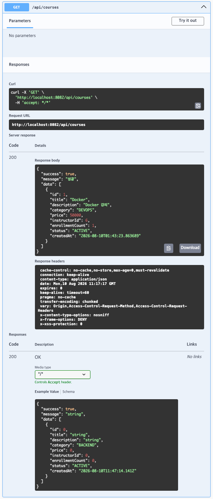
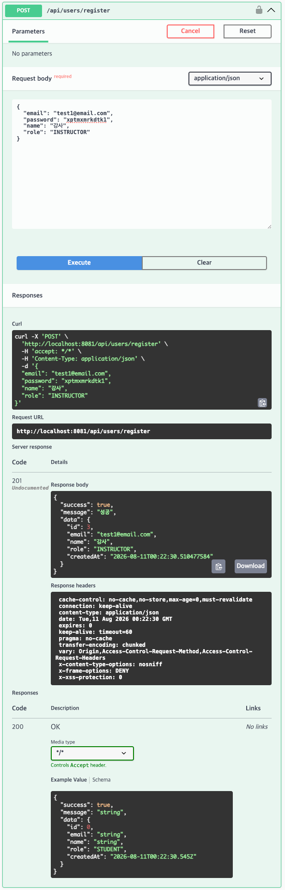
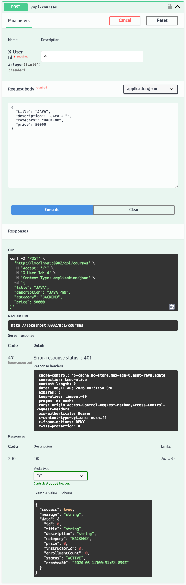
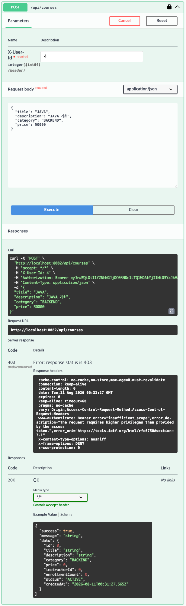
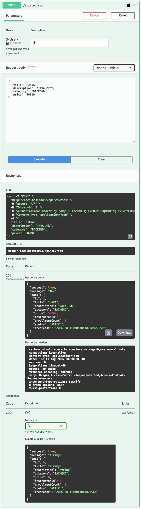
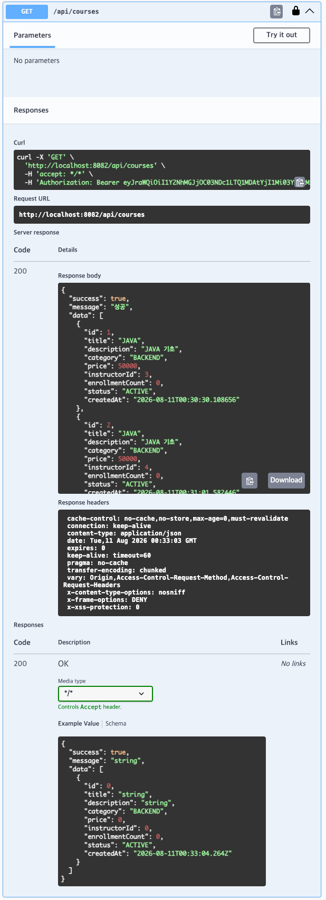

# Course / User 검증 결과

담당: 백엔드 Course/User
검증일: 2026-08-10
검증 환경: 로컬 docker-compose 전체 스택 (10개 컨테이너 정상 기동 상태)

## 1. 검증 개요

이 문서는 `course-service`, `user-service`가 API 명세대로 동작하는지, 그리고
로컬 편의를 위해 꺼져 있던 `SecurityConfig`(JWT 인증/역할 검사)를 복구하는
과정에서 실제로 무엇이 맞았고 무엇이 깨졌는지를 결과 중심으로 정리한다.
`enrollment-payment-verification.md`와 같은 기준으로, **코드 내부 로직 설명은
다루지 않고 검증 결과만** 정리한다.

| 구성요소              | 알아야 할 것 (이 문서가 다루는 것)                                         | 몰라도 되는 것 (다루지 않음)        |
| --------------------- | -------------------------------------------------------------------------- | ----------------------------------- |
| course-service        | 조회 3종 API가 명세대로 응답하고, 강의 등록은 INSTRUCTOR만 가능하다는 결과 | JPA/Repository 내부 쿼리            |
| user-service          | 회원가입/내 정보 조회가 명세대로 동작한다는 결과                           | 비밀번호 인코딩 내부 구현           |
| 공통 (SecurityConfig) | JWT 인증을 켰을 때 실제로 401/403/201이 기대대로 나오는지                  | Spring Security 필터 체인 세부 구조 |

## 2. 조회 API 확인 결과 (인증 불필요)

Swagger UI(`http://localhost:8082/swagger-ui/index.html`)에서 Try it out으로
호출한 결과. 세 API 모두 응답 래퍼(`success`, `message`, `data`)가 03번
API 명세서와 동일하게 내려오는 것을 확인했다.

| API                | Method                                 | Request           | Status |
| ------------------ | -------------------------------------- | ----------------- | ------ |
| 교육 프로그램 목록 | `GET /api/courses`                     | -                 | 200    |
| 교육 프로그램 상세 | `GET /api/courses/{id}`                | `id=1`            | 200    |
| 카테고리별 조회    | `GET /api/courses/category/{category}` | `category=DEVOPS` | 200    |



상세 조회(`/{id}`)와 카테고리별 조회(`/category/{category}`)는 응답 구조가
목록 조회와 동일해 별도 캡처는 생략했다(둘 다 200, 동일한 응답 래퍼 확인).

## 3. 강의 등록 API — 인증/권한 복구 (커밋 `6a55877`)

기존 `SecurityConfig`는 두 서비스 모두 `anyRequest().permitAll()`로 JWT 검증
자체가 꺼져 있었다. 원래 의도(주석으로 남아있던 코드)대로 복구하면서 아래처럼
정리했다.

### course-service

| 항목                                  | Before                | After                                 |
| ------------------------------------- | --------------------- | ------------------------------------- |
| 인증 방식                             | 없음 (전체 permitAll) | `oauth2ResourceServer().jwt()` 활성화 |
| swagger/api-docs                      | permitAll             | permitAll (유지)                      |
| `GET /api/courses`, `/api/courses/**` | permitAll             | permitAll (유지)                      |
| `POST /api/courses`                   | permitAll             | `ROLE_INSTRUCTOR` 권한 필요           |
| `/api/courses/internal/**`            | permitAll             | **permitAll 유지** (아래 참고)        |
| 그 외 요청                            | permitAll             | 인증 필요                             |

`internal/**`는 원래 `SCOPE_service.read`로 막으려 했으나, enrollment-service의
`WebClient`와 recommend-service의 `course_client.py`가 내부 호출 시
Authorization 헤더를 붙이지 않는 구조라 막으면 계약 신청/추천 흐름이 401로
깨진다. 서비스 간 client-credentials 토큰 전파가 구현되기 전까지는 permitAll로
유지하기로 하고 코드에 TODO 주석을 남겼다.

### user-service

| 항목                           | Before                | After                                 |
| ------------------------------ | --------------------- | ------------------------------------- |
| 인증 방식                      | 없음 (전체 permitAll) | `oauth2ResourceServer().jwt()` 활성화 |
| `POST /api/users/register`     | permitAll             | permitAll (유지)                      |
| swagger/api-docs               | permitAll             | permitAll (유지)                      |
| `/api/users/internal/**`       | permitAll             | `SCOPE_service.read` 권한 필요        |
| 그 외 요청 (`/me`, `/{id}` 등) | permitAll             | 인증 필요                             |

### 추가로 필요했던 것: role → authority 매핑

Spring Security 기본 `JwtAuthenticationConverter`는 JWT의 `scope` 클레임만
`SCOPE_x` 권한으로 자동 변환하고, auth-server가 심어주는 `role`(STUDENT/
INSTRUCTOR) 클레임은 그대로 무시한다. 즉 `hasAuthority("ROLE_INSTRUCTOR")`는
복구만으로는 절대 통과하지 못했다. course-service에 커스텀
`JwtAuthenticationConverter` Bean을 추가해 `role` 클레임을 `ROLE_x` 권한으로
매핑하도록 고쳤다 (`course-service/SecurityConfig.java`, 커밋 `6a55877`).

## 4. 실전 로그인 검증

실제 계정(STUDENT/INSTRUCTOR)과 발급받은 토큰으로 재현해서 확인한 결과다.

| 시나리오                                | 기대 | 결과                   |
| --------------------------------------- | ---- | ---------------------- |
| 교육 공급자(INSTRUCTOR) 계정 회원가입   | 201  | ✅ 201                 |
| 토큰 없이 `POST /api/courses`           | 401  | ✅ 401                 |
| STUDENT 토큰으로 `POST /api/courses`    | 403  | ✅ 403                 |
| INSTRUCTOR 토큰으로 `POST /api/courses` | 201  | ✅ 201, 강의 정상 생성 |
| 등록 직후 `GET /api/courses`            | 200  | ✅ 200, 목록에 반영됨  |











### 참고: issuer-uri 문제와 해결

로그인 플로우를 재현해서 실제 발급 JWT를 까보면 `iss`(발급자) 값이
`http://localhost:8080`(Gateway 경유 주소)이다. `docker-compose.yml`의
user-service/course-service issuer-uri가 컨테이너 내부 호스트명
(`http://auth-server:9000`)으로 고정돼 있으면 `JwtIssuerValidator`가 이 값과
`iss`를 문자열로 비교해 무조건 거부(401)한다. 이 저장소의 `docker-compose.yml`
에서 두 서비스의 issuer-uri를 `http://localhost:8080`으로 수정해 위 표의
결과를 확인했다.

```diff
  # user-service, course-service 블록 각각
- SPRING_SECURITY_OAUTH2_RESOURCESERVER_JWT_ISSUER_URI=http://auth-server:9000
+ SPRING_SECURITY_OAUTH2_RESOURCESERVER_JWT_ISSUER_URI=http://localhost:8080
```

`jwk-set-uri`(서명 검증용 공개키 조회 주소)는 실제 네트워크로 도달해야 하는
주소라 `http://auth-server:9000/oauth2/jwks` 그대로 유지했다. issuer-uri는
네트워크 주소가 아니라 "토큰에 적힌 발급자 문자열과 비교할 값"이라 둘의 역할이
다르다.

`enrollment-service`, `payment-service`도 같은 값(`http://auth-server:9000`)을
쓰고 있다. 지금은 두 서비스의 SecurityConfig가 아직 `permitAll`이라 당장
영향은 없지만, 나중에 JWT 검증을 켜는 순간 똑같이 401이 재현된다. 3번
담당자에게 미리 공유가 필요하다. 자세한 원인 분석은
[login-401-issuer-mismatch.md](login-401-issuer-mismatch.md) 참고.

## 5. Swagger 확인 및 캡처 가이드

- `http://localhost:8082/swagger-ui/index.html` (course-service),
  `http://localhost:8081/swagger-ui/index.html` (user-service) 모두 정상 노출
  확인.
- 위 issuer-uri가 고쳐지기 전까지는 Swagger의 Authorize 버튼으로 토큰을 넣어도
  `POST /api/courses`가 401로 막힐 수 있다. 이 경우 SecurityConfig가 아니라
  issuer-uri 문제인지부터 의심할 것 (3번 항목 참고).
- 캡처 순서: ① `GET /api/courses` → ② `GET /api/courses/{id}` → ③
  `GET /api/courses/category/{category}` 순으로 Try it out. 각 단계 응답
  영역(`.opblock`)만 캡처하면 화면이 과도하게 길어지지 않는다.
- 파일명 규칙: `NN_snake_case_설명.png` (2자리 순번 + 언더스코어 + 영문 소문자
  설명). `docs/assets/<문서-이름>/` 폴더 아래에 둔다.

## 6. 트러블슈팅 기록

| 이슈                                                                    | 원인                                                                                                            | 해결/비고                                                                      |
| ----------------------------------------------------------------------- | --------------------------------------------------------------------------------------------------------------- | ------------------------------------------------------------------------------ |
| `POST /api/courses`가 INSTRUCTOR로 로그인해도 계속 403                  | 기본 `JwtAuthenticationConverter`가 `role` 클레임을 권한으로 매핑 안 함                                         | 커스텀 `JwtAuthenticationConverter` Bean 추가 (커밋 `6a55877`, course-service) |
| `internal/**` GET API가 SCOPE 체크 없이 열려 있었음                     | 주석 처리됐던 원본 코드의 매처 순서 문제 (`GET /api/courses/**` permitAll이 `internal/**` 체크보다 먼저 매칭)   | 매처 순서 조정, 지금은 internal을 아예 permitAll로 명시 (2번 항목 참고)        |
| 로그인 직후 `/api/users/me` 401 (로컬 검증 중 발견, 팀 저장소엔 미반영) | `docker-compose.yml`의 issuer-uri가 `http://auth-server:9000`로 고정, 실제 토큰 `iss`는 `http://localhost:8080` | 4번 항목 참고, 팀 저장소 반영 필요                                             |
