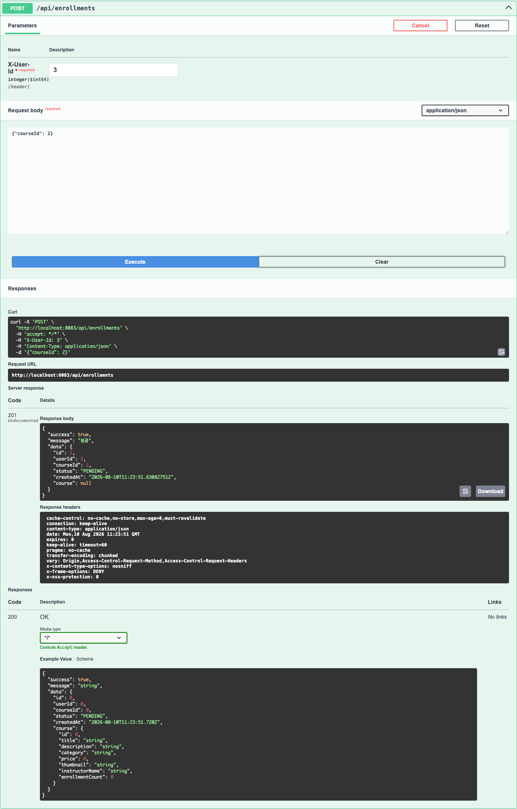
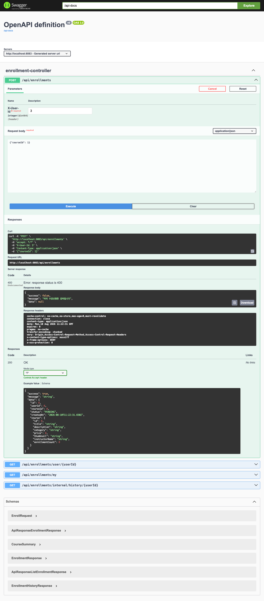
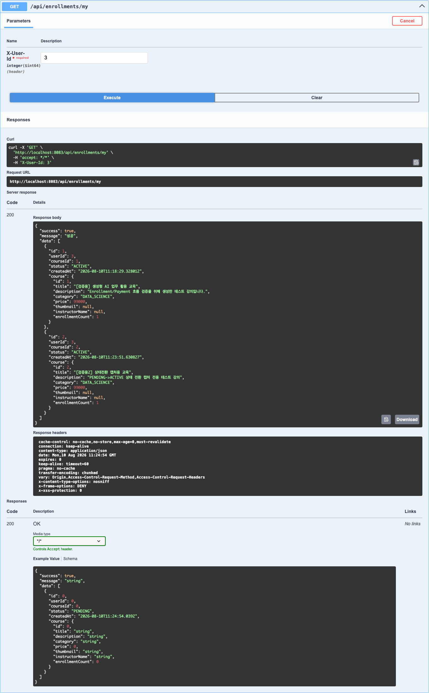
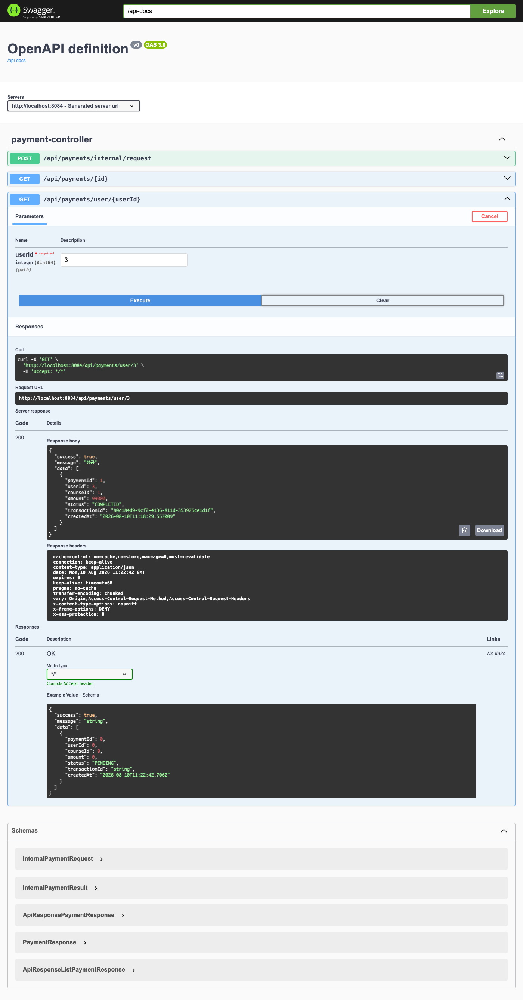

# Enrollment / Payment 검증 결과 (3번 역할)

담당: 백엔드 Enrollment/Payment
검증일: 2026-08-10
검증 환경: 로컬 docker-compose 전체 스택 (10개 컨테이너 정상 기동 상태)

## 1. 검증 개요

이 문서는 `enrollment-service`, `payment-service`가 실제로 "계약 신청 → 결제 처리 → 상태 자동 변경" 흐름대로 동작하는지 API 호출 결과로 확인한 기록이다. `Agile_MSA_실습_가이드_수정_v2.pdf` 4절의 기준에 따라 **코드 내부 로직 설명은 다루지 않고, 결과만 정리**한다.

| 구성요소 | 알아야 할 것 (이 문서가 다루는 것) | 몰라도 되는 것 (다루지 않음) |
|---|---|---|
| enrollment-service | 신청하면 이벤트가 발생하고, 결제 후 자동으로 상태가 PENDING → ACTIVE로 바뀐다는 흐름 | Kafka Producer/Consumer 코드 |
| payment-service | 결제 완료 호출 → 이후 enrollment 상태가 바뀐다는 결과 | 결제 처리 내부 로직 |

**검증에 사용한 테스트 데이터**

| 항목 | 값 |
|---|---|
| HRD 담당자 계정 (STUDENT) | id=3, hrd-verify@example.com |
| 교육 공급자 계정 (INSTRUCTOR) | id=4, provider-verify@example.com |
| 테스트 강의 1 | id=1, "[검증용] 생성형 AI 업무 활용 교육" |
| 테스트 강의 2 | id=2, "[검증용2] 상태전환 캡처용 교육" (PENDING→ACTIVE 전환 캡처 전용) |

## 2. 계약 신청 API 확인 결과

`POST /api/enrollments` (enrollment-service, Swagger Try it out)

- 요청: `X-User-Id: 3`, body `{"courseId": 2}`
- 응답: `201`, `status: "PENDING"` — 결제·상태 활성화가 끝나기 전, 신청 시점의 응답 그대로



이미 신청한 강의(courseId=1)에 다시 신청을 시도하면 아래처럼 중복 신청 방지가 정상 동작한다.



## 3. payment completed 후 enrollment 상태 변화 캡처

같은 신청(courseId=2, id=2 enrollment)을 잠시 후 `GET /api/enrollments/my`로 다시 조회하면 별도 요청 없이 `status`가 **ACTIVE**로 바뀌어 있다. 즉 `POST /api/enrollments`의 REST 응답 자체는 상태 확정을 보장하지 않고, payment-service의 결제 완료 이후 비동기로 상태가 바뀐다.



## 4. 결제 결과 확인

`GET /api/payments/user/3` (payment-service, Swagger Try it out)

- `status: "COMPLETED"`, `transactionId` 발급됨, `amount: 99000`



## 5. (보조 근거) 이벤트 발생 로그

Kafka 내부 구조는 다루지 않고, "이벤트가 실제로 오갔다"는 결과 증거로 컨테이너 로그만 첨부한다. (courseId=2 신청 건 기준, `docker logs lecture-payment` / `docker logs lecture-enrollment`)

```
[payment-service]
11:23:51.675  결제 요청 - userId: 3, courseId: 2, amount: 99000
11:23:51.683  payment.completed 발행 시도
11:23:51.704  payment.completed 발행 성공 - partition: 2, offset: 1

[enrollment-service]
11:23:51.709  payment.completed raw event 수신: {paymentId=2, userId=3, courseId=2, status=COMPLETED}
11:23:51.720  enrollment.completed 발행 - enrollmentId: 2, userId: 3, courseId: 2
11:23:51.728  수강 활성화 완료 - userId: 3, courseId: 2
```

결제 요청부터 상태 활성화 완료까지 실제 소요 시간은 약 50ms(로그 기준)로, 사용자 입장에서는 "신청 직후 곧바로 확정"되는 것처럼 보인다.

## 6. Swagger 확인 결과 및 캡처 가이드

- `http://localhost:8083/swagger-ui/index.html` (enrollment-service), `http://localhost:8084/swagger-ui/index.html` (payment-service) 모두 정상 노출 확인.
- **Authorize 버튼이 보이지 않는 것은 정상이다.** 두 서비스의 `SecurityConfig`가 현재 `anyRequest().permitAll()`로 설정되어 있어(JWT 검증 코드는 주석 처리된 상태) Bearer 토큰 없이 바로 테스트할 수 있다. 대신 `POST /api/enrollments`, `GET /api/enrollments/my`에는 `X-User-Id` 헤더 입력란이 파라미터로 노출되므로 여기에 사용자 id를 직접 입력하면 된다.
- 캡처 순서: ① `POST /api/enrollments` Try it out (X-User-Id + `{"courseId": ...}`) → ② `GET /api/enrollments/my` Try it out으로 몇 초 뒤 재조회 → ③ payment-service `GET /api/payments/user/{userId}` Try it out. 각 단계 응답 영역(`.opblock`)만 캡처하면 화면이 과도하게 길어지지 않는다.

## 7. 포트/컨테이너 트러블슈팅 기록

| 이슈 | 원인 | 해결/비고 |
|---|---|---|
| Swagger UI에 Authorize 버튼이 없음 | enrollment/payment-service의 `SecurityConfig`가 `anyRequest().permitAll()`로 설정되어 있어 OpenAPI 스펙에 security scheme이 등록되지 않음 (JWT 검증용 코드는 주석 처리됨) | 버그가 아니라 현재 두 서비스는 인증 없이 호출 가능한 상태. `X-User-Id` 헤더만 채우면 테스트 가능. 실제 JWT 검증을 되살릴지는 팀 논의 필요 |
| curl로 OAuth2 인가 코드 추출 시 `invalid_grant` | HTTP 헤더의 `\r`이 코드 값에 섞여 들어감 | `tr -d '\r'`로 정제 후 해결 (상세: `실습_보고서.md` Chapter 3) |

그 외 컨테이너 기동 관련 이슈는 없었음 — 검증 시작 시점에 10개 컨테이너 모두 정상(healthy) 상태였음.
